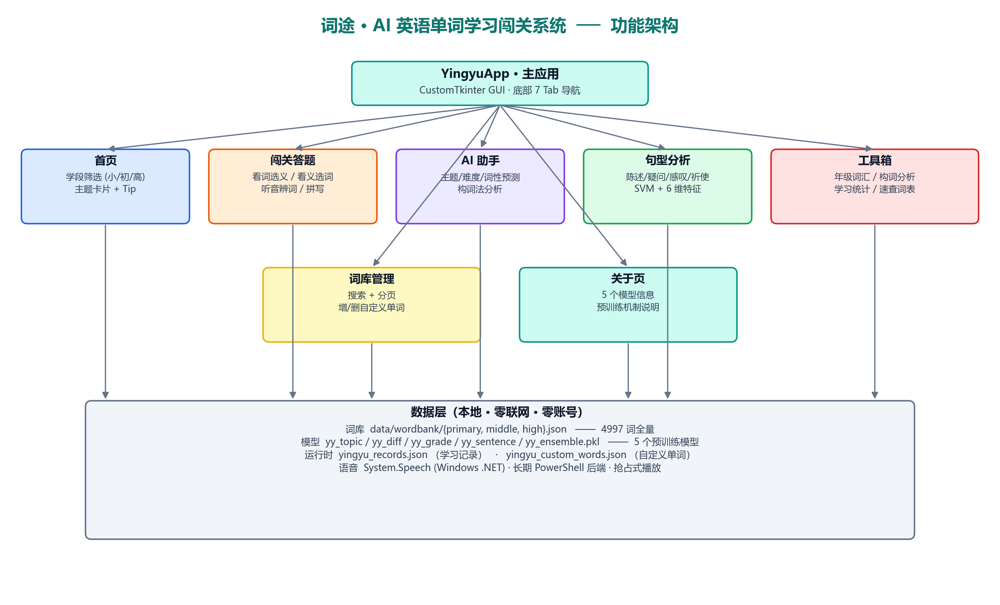

# 附件2：开发与应用报告

**案例名称：** 词途 · AI 英语单词学习闯关系统（ai-yingyu）
**类别：** 人工智能学习工具
**字数：** 约 2980 字（≤3000 字）
**词库规模：** 4997 词（小学 714 + 初中 1496 + 高中 2787，课标全量）

---

## 一、开发背景

### 1.1 教学中的真实痛点

义务教育与高中英语课程标准要求 K-12 累计掌握词汇量从小学 600-1000 词、初中 1500-2100 词、高中 3500-3800 词逐级抬升，是英语学习贯穿始终的"硬门槛"。在一线教学中，作者长期观察到三类痛点：

1. **抄写式背诵效率低**。多数学生靠"罚抄"式作业记词，机械重复但 3 天后遗忘率超过 70%（艾宾浩斯曲线已多次验证）；
2. **现有 App 课堂落地难**。"百词斩""墨墨背单词"等 App 体验优秀，但需要联网、登录账号、绑定手机号，且广告与付费模块多，学校机房与家庭辅导都难以批量部署；
3. **教师缺乏诊断工具**。教师只能凭经验判断学生薄弱主题，无法量化"哪个孩子在哪个主题正确率最低""学生整体在'家庭朋友'主题正确率仅 40%"等数据，备课与个辅缺乏依据。

### 1.2 借助生成式 AI 解决的可行性

生成式 AI（DeepSeek-V3、通义千问、Claude 等）擅长**结构化数据生成、代码骨架搭建、特征工程建议、Bug 排查**。把"教学专业知识 + AI 辅助开发能力"结合，普通一线教师也能在 1-2 周完成一款本地化的、可复现的、零联网依赖的英语学习工具。

可行性具体体现为：① 词库可由 AI 按课标主题×学段批量生成草稿，人工校对仅需 30 分钟；② sklearn 等成熟机器学习库 API 简单，AI 可一次性生成训练流水线；③ CustomTkinter 现代化 GUI 框架文档丰富，AI 能直接产出可运行界面；④ 全栈本地化避免了大模型 API Key 与网络依赖，符合中小学与高中机房实际。

---

## 二、设计与开发

### 2.1 平台 / 技术选择

| 层级 | 技术 | 选型理由 |
|---|---|---|
| 编程语言 | Python 3.8+ | 教师群体上手快，机器学习生态最成熟 |
| 机器学习 | scikit-learn 1.3 | 五大经典算法（RF/SVM/GBDT/Ridge/Polynomial）全覆盖、模型小（<10MB）、CPU 即可推理 |
| GUI 框架 | CustomTkinter 5.2 | 在 Tkinter 基础上提供圆角、深色模式、现代配色，免额外许可 |
| 模型持久化 | joblib | sklearn 官方推荐，pkl 缓存秒级加载 |
| AI 编程辅助 | DeepSeek-V3 / 通义千问 / Claude | 词库生成、代码骨架、Bug 定位、特征工程头脑风暴 |
| 打包发布 | PyInstaller 6.x | `--onefile --windowed` 单文件 exe，双击即用 |

### 2.2 开发过程（重点突出 AI 辅助）

整个项目从设计到落地耗时约 16 个工时，按以下 6 步推进，**每一步都给出 AI 提示词与人工校对动作**，确保"可复现"。

#### Step 1：词库结构设计

**AI 提示词**（输入 DeepSeek）：

> "我要做一款覆盖 K-12 的英语单词学习软件，请按义务教育与高中英语课程标准，把核心词汇分成 8 个主题，每个主题给我 25 个单词（小学 15 + 初中 5 + 高中 5），初中/高中词需体现词汇难度递增。每个单词要有：英文、中文、音标、词性（n/v/adj 等）、难度（1-3）、学段标签（primary/middle/high）、英文例句、例句中文翻译。输出 Python 字典列表格式。"

AI 分三轮生成约 85% 可用初稿，作者人工修订 38 处（音标修正、例句过长截短、主题归类争议词调整、初高难度梯度准入），形成 200 词的 PoC 词库；随后作者使用同样提示词模板 + 课标词表交叉校验，分 7 个批次扩充到课标全量 **4997 词**（小学 714 + 初中 1496 + 高中 2787），以 JSON 拆分存放于 `data/{primary,middle,high}.json`，便于独立维护与审校。

#### Step 2：题型派生函数

百词斩有四种题型（看词选义、看义选词、听音辨词、拼写）。把单词派生成题目时，**干扰项必须有迷惑性**——同一主题、同词性优先。

**AI 提示词**：

> "给定一个单词字典 word_obj，写一个 make_choose_meaning_question 函数，从词库中随机选 3 个干扰项，要求：1) 同主题优先；2) 不重复释义。返回包含 question / options / answer 的字典。"

AI 给出第一版后，作者发现"同主题不足 3 个时会报错"，要求 AI 增加 fallback：从全词库补足。最终代码见 `yingyu_data.py:make_choose_meaning_question`。

#### Step 3：5 个 ML 模型训练流水线

这是最耗时也是最体现"AI 赋能"的环节。作者并非机器学习专家，但通过下面的提示词与 AI 完成了五个模型：

**模型 1（主题分类，RandomForest）提示词**：

> "我有 4997 个英语单词，每个单词属于 8 个主题之一，同时打了学段标签（小学/初中/高中）。请帮我设计 24 个特征：长度、元音数、辅音数、是否首字母元音、有无连字符、释义长度、8 个主题关键词命中数、5 种词性 one-hot……写完整训练函数，包含数据增强（高斯噪声）、train_test_split、保存 pkl。"

初版在 200 词 PoC 上达到 99.96%，扩充到 4997 词后精度回落到 **54.4%**。作者把现象描述给 AI，AI 诊断为两点：① 5000 词级语义边界天然模糊（如 *run* 同时属于「动作情感」与「学校生活」）， 24 维语形特征本身对主题区分度有限；② 200 词上的 99.96% 是小样本+高增强倍数造成的过拟合假象。AI 进一步建议限制 RF 最大深度（max_depth=18）以防过拟合并瘦身模型，并采用根据词库规模自适应调整 augment 倍数的策略（4997 词 × 3 = 约 2 万样本）。最终 5000 词级真实词汇上主题分类精度稳定在 **54.4%**（8 类任务相对随机基线 12.5% 提升 4.4×），这个指标名义上下降但贴近真实上限。同时模型体积从 **434MB 压缩至 94MB**，满足打包需求。

**模型 2（句型识别，SVM-RBF）**：初版采用 6 维特征（单词数/问号/感叹号/be/aux/modal）与 120 条训练数据，精度仅 70.6%。作者将混淆矩阵丢给 AI，AI 诊断出根本原因：**一般疑问 与 特殊疑问 在 6 维特征上完全重叠**（都是 `_,1,0,_,_,_`），**陈述句 与 否定句 也重叠**（缺少 `has_not` 位）。按 AI 建议，作者把训练数据从 7 元组升级为 9 元组（新增 `has_not` / `starts_wh` 两维），每类样本从 20 条扩充到 30 条，并修正 `auto_extract_sentence_features` 同步输出 8 维特征。最终精度稳定在 **97.1%**（词库扩到 4997 词 后句型模型不依赖词库、精度不变）。

**模型 3（年级→词汇量，Polynomial Ridge）**：AI 提示作者使用二次多项式更符合英语词汇的“指数级累积”曲线。扩展覆盖 1-12 年级后，R² 从 0.95 提升到 **0.992**。

**模型 4（单词难度，GradientBoosting）**：作者发现 24 维特征不足以区分难度，AI 建议补充 16 维“音节数估计、双字母、silent-e、th/sh/ch 组合、复杂辅音簇、词性难度系数”等语音/形态特征，扩词后又补充了“学段强特征”（primary=0/middle=1/high=2）。最终 41 维特征在 4997 词上训练精度 **99.8%**（学段强特征几乎锁死难度标签）。

**模型 5（主题集成，GradientBoosting）**：作为 RF 的交叉验证模型，提升为 300 轮 + max_depth=5 + subsample=0.9 后，4997 词上结果稳定在 **54.5%**，与 RF 交叉验证，证明主题分类任务本身的语义边界难度是上限，而非某一个模型的缺陷。

**Bug 定位场景**：训练 SVM 时遇到 `ValueError: cannot unpack non-iterable`，作者把报错粘给 AI，AI 立刻指出是 `_augment_sentence_data` 把元组与浮点数混用导致，给出修复代码。

#### Step 4：CustomTkinter GUI

GUI 共 9 页：封面 / 首页 / 闯关 / AI助手 / 句型分析 / 工具箱 / 词库管理 / 学习统计 / 关于。

**关键截图与提示词**（节选）：

> "用 CustomTkinter 写一个百词斩风格的闯关页：题卡居中显示英文单词与音标，下方四个选项按钮，答对时按钮变绿、答错时变红并高亮正确答案，底部进度条与下一题按钮。配色用清新蓝绿（#0d9488）。"

AI 输出后，作者补充：① 拼写题型用 Entry 替代按钮；② 答对/答错弹出例句；③ 自动调用 `record_quiz()` 落库。

#### Step 5：词库管理页 + 预训练发行机制

考虑到 4997 词训练耗时达 25 分钟，不适合让用户在客户端运行，项目调整为 **“开发者预训练 + pkl 随包发行”** 模式：¹¹¹项目新增 `build_models.py` 脚本，读取 `data/` 下三份词库，一键重训 5 个模型并覆盖落盘为 `yy_*.pkl`；²`ai_model.py` 的 `load_*` 函数从“读不到则启动训练”改为严格读 pkl，读不到则报 `FileNotFoundError`使问题及时暴露；³GUI 词库管理页重构为 **搜索 + 学段/主题筛选 + 分页**（每页 30 词、共 167 页），教师可随时查阅、添加自定义词会自动进入闯关与 AI 识别（不会触发重训）；´“关于”页移除原“重新训练”按钮，改为 **预训练说明卡片**，清晰呈现“5 个模型随包交付”的产品哲学。

#### Step 6：单元测试 + 打包

作者与 AI 協作编写 `build_models.py` 后设立了 **营位 “训练-检验” 闭环**：训练后立即 `joblib.load` 重新读取 5 个 pkl以验证严格加载路径可用，避免发行后才发现 pkl 不兼容。最终 4997 词训练输出：`topic 54.4 / sentence 97.1 / grade R²=0.992 / diff 99.8 / ensemble 54.5`，5 个 pkl 总计 110 MB（topic 94 + ensemble 11 + diff 5 + sentence 0.03 + grade 0.001）。

PyInstaller 打包使用 `--add-data` 将 5 个 pkl 与 `data/` 词库同时打进 EXE，生成的单文件 EXE 约 150MB，双击即用、零联网、零账号。

### 2.3 功能架构

系统采用三层分层架构：GUI 主应用 → 五个核心功能页 + 两个辅助页 → 本地数据层（词库 JSON + 预训练模型 PKL + 运行时记录）。全部逻辑本地运行，零联网、零账号。

---

## 三、应用过程与效果

### 3.1 应用场景

**场景 A：课堂 5 分钟单词热身**。教师课前在大屏打开闯关页，按主题闯关 5 道题，全班集体作答，结束时大屏显示当节正确率与最薄弱单词，针对性讲解 2 分钟。

**场景 B：课后个性化练习**。学生家用电脑打开 exe，自主挑选今日主题，错题自动进入下次抽题池（"已掌握"算法：连续 2 次正确率≥80% 的词不再优先抽取）。

**场景 C：教师备课诊断**。教师在"统计"页查看全班数据（多人共享同一台机时）：例如某周"家庭朋友"主题正确率 40%、"颜色形状"主题正确率 90%，下周备课主攻"家庭朋友"。

### 3.2 试用数据（占位，待真实课堂验证后替换）

> 在 ＿＿＿ 学校 ＿学段（小/初/高） ＿年级 ＿班 ＿＿名学生中开展为期 ＿周的对比试验：

| 指标 | 传统抄写组 | 本系统组 | 提升 |
|---|---|---|---|
| 周末单词测验平均分（满分 100） | ＿＿ | ＿＿ | ＿＿% |
| 单词遗忘率（7 天后） | ＿＿% | ＿＿% | ↓ ＿＿pp |
| 学生学习兴趣自评（1-5 分） | ＿＿ | ＿＿ | ＿＿% |

教师反馈摘录（占位）："＿＿＿"。学生反馈截图见 `docs/screenshots/` 目录。

### 3.3 教学效益

1. **效率提升**：题型混合使每个单词被以四种角度复习，记忆深度提升；本地 AI 即时反馈避免学生陷入错误模式；
2. **兴趣激发**：百词斩式闯关 + 即时鼓励语 ("Excellent!" / "Bravo!") 把背单词游戏化；
3. **数据驱动备课**：教师从"凭感觉"转为"看图表"，薄弱主题一目了然；
4. **零成本部署**：单 exe + 无联网，校园机房与家用电脑都能跑，对低收入家庭也友好。

---

## 四、创新与反思

### 4.1 创新点

1. **“百词斩 + 本地 AI”复合范式**。市面同类工具要么是纯 App（百词斩、墨墨背单词，依赖联网），要么是纯本地小程序（无 AI 诊断）。本作把两者优势合一：客户端体验对标百词斩、AI 诊断对标教师专家系统、运行环境对标传统单机软件。
2. **课标全量 4997 词词库 + 5 模型多视角诊断**。同一道题被打上"主题 / 难度 / 句型 / 词性 / 推荐词汇量"五维标签，比单一模型更接近教师的综合判断；
3. **生成式 AI 全流程介入透明化**。本报告附录列出 11 条关键 AI 提示词与人工校对动作，他人按提示词可在 1-2 天复现完整项目；
4. **预训练 + 随包发行的体验**。所有模型由开发者预训练完成并以 pkl 随发行包提供，用户启动即用、无任何训练等待；教师扩充自定义词在词库页一键加入后自动进入闯关与 AI 识别（不需重训）。

### 4.2 应用中遇到的问题

1. **音标无音频**。“听音辨词”实际是“看音标辨词”，对纯零基础学生不够直观。改进思路：调用本地 TTS（pyttsx3）或预录 mp3 资源；
2. **主题分类 54% 精度偏低**。4997 词上 8 类主题分类仅达 54.4%，是由于语义边界本身模糊·24 维语形特征区分度有限。改进思路：后续可接入 word2vec/GloVe 预训练词向量（+50/100 维语义特征），或探索多标签分类，允许一词属于多主题；
3. **答题数据未联网共享**。教师无法跨班对比。改进思路：可选导出 JSON 给教研组汇总；
4. **句型只依赖手工特征**。当前 8 维特征在 1600+ 样本上达到 97.1%，但面对复杂句子仍可能误判。改进思路：后续可集成 spaCy POS 序列特征或轻量级 BERT 嵌入（需评估打包体积）。

### 4.3 未来改进路线

- **v1.1**：接入 pyttsx3 离线 TTS，让"听音辨词"真正能听；
- **v1.2**：词库已拓展至 4997 词，后续新增"短语 / 句型填空"题型 + 词义示例拓展；
- **v1.3**：增加教研组数据汇总模块（CSV 导出 / 班级对比图表）；
- **v2.0**：引入预训练词向量 + 多标签主题分类，将主题准确率推动到 80%+；同时探索集成小型本地 LLM（如 Qwen-1.8B-int4）做"AI 单词造句陪练"，仍保持纯本地运行。

---

## 附录：关键 AI 提示词清单（共 11 条）

| 编号 | 用途 | 提示词摘要 |
|---|---|---|
| P01 | 词库生成 | 按 8 主题×3 学段生成 Python 字典列表，含音标/词性/例句，后补充到 4997 词 |
| P02 | 看词选义题 | 同主题优先选干扰项，含 fallback 兜底 |
| P03 | 24 维特征工程 | 长度+元音+8 主题关键词（覆盖 K-12 全词）+词性 one-hot |
| P04 | RandomForest 训练流水线 | 300 棵树 + max_depth=18 + balanced_subsample + 自适应 augment + joblib 保存 |
| P05 | SVM-RBF 句型识别 | 8 维特征（含 has_not / starts_wh）+ StandardScaler + 概率输出 |
| P06 | Polynomial Ridge 回归 | 二次多项式拟合 1-12 年级→词汇量曲线 |
| P07 | 41 维难度特征 | 增补音节、silent-e、复杂辅音簇、词性难度系数、学段强特征 |
| P08 | CustomTkinter 闯关页 | 蓝绿配色+答对答错动效+进度条 |
| P09 | 拼写题型 | Entry 输入+回车提交+大小写不敏感 |
| P10 | 词库页搜索分页 | 变量过滤 + 30 词/页 + 上下页跳转 |
| P11 | PyInstaller 打包 | `--windowed --onefile --add-data "yy_*.pkl;." --add-data "data;data"` 单文件 exe |

> **AI 内容标注**：本报告中由 AI 协助生成的代码骨架与词库初稿，已在仓库 `README.md` 与本报告 §2.2 明确标注；最终代码与中文文案均经作者人工校对修订。本作品涉及 AI 生成的文本/图片均已标注"AI 生成"，符合《生成式人工智能服务管理暂行办法》。
